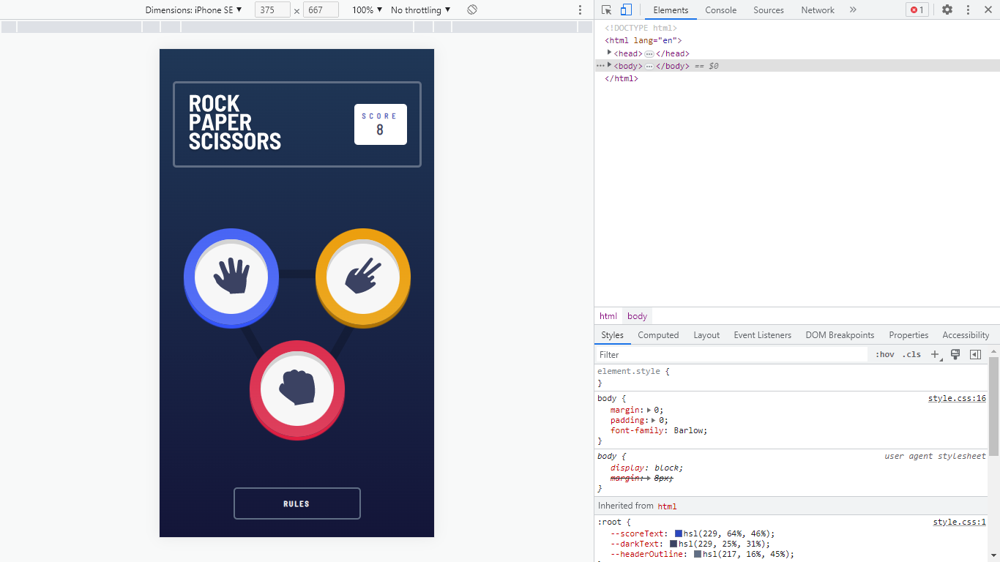

# Rock Paper Scissors Master

## Table of Contents
- [Overview](#overview)
- [Screenshot](#screenshot)
- [Rules](#Rules)
- [Original](#Original)
- [Bonus](#Bonus)
- [Languages](#Languages)
- [Steps](#Steps-To-Development)
- [Deployment](#deployed-link)

## Overview
Project objective for this challenge is to build out this Rock, Paper, Scissors game and get it looking as close to the design as possible.

Users should be able to:
- View the optimal layout for the game depending on their device's screen size
- Play Rock, Paper, Scissors against the computer
- Maintain the state of the score after refreshing the browser

## Screenshot

### Rules

If the player wins, they gain 1 point. If the computer wins, the player loses one point.

### Original

- Paper beats Rock
- Rock beats Scissors
- Scissors beats Paper

### Bonus

- Scissors beats Paper
- Paper beats Rock
- Rock beats Lizard
- Lizard beats Spock
- Spock beats Scissors
- Scissors beats Lizard
- Paper beats Spock
- Rock beats Scissors
- Lizard beats Paper
- Spock beats Rock

## Languages 

<code>- HTML5 
- CSS 
- JavaScript</code>

## Steps To Development

- [x] 27th march, 2023.
- Added and Designed the README file
- Created the style.css file
- Added the required tags for the index.html to perfectly matched with the css styles.
- Deployed page to netlify

- [x] 28th - 29th march, 2023.
- Added style.css codes
- More fixes

- [x] 30th march, 2023.
- Added JavaScript codes in app.js file
- More fixes

- [x] 31st march, 2023.
- Updated index.html and style.css
- Imported Barlow_Semi_Condensed font-family
- More fixes

- [x] 1st April, 2023.
- More fixes

- [x] 3rd April, 2023.
- Added localStorage to the score to maintain it state on browser refresh.
- More fixes

## Deployed Link
Deployed link: https://da-rpsmaster.netlify.app/

## Learn More
Not sure what Rock, Paper, Scissors, Lizard, Spock is? [Check out this clip from The Big Bang Theory](https://www.youtube.com/watch?v=iSHPVCBsnLw).